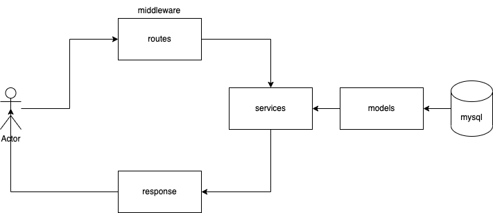
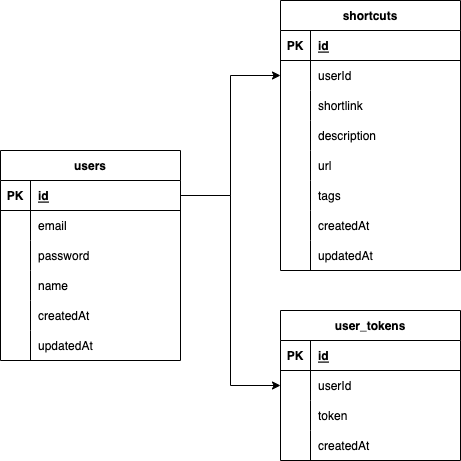
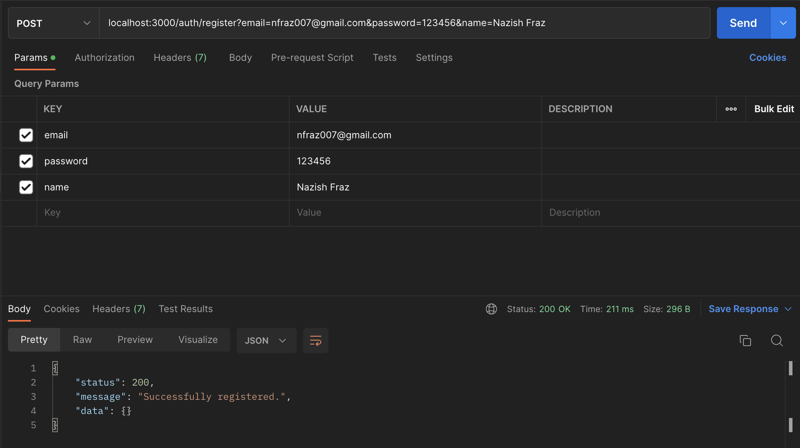
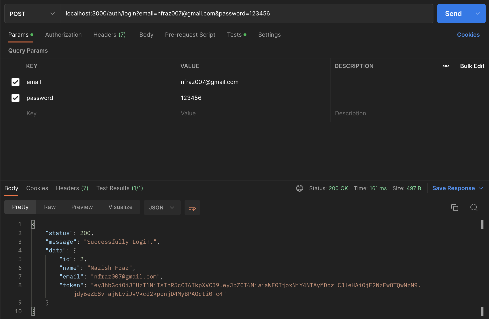
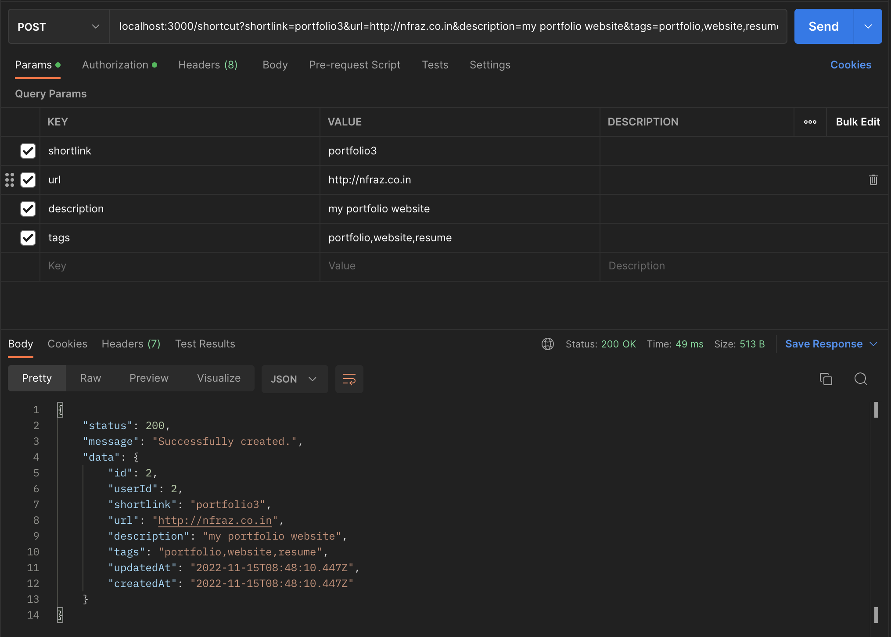
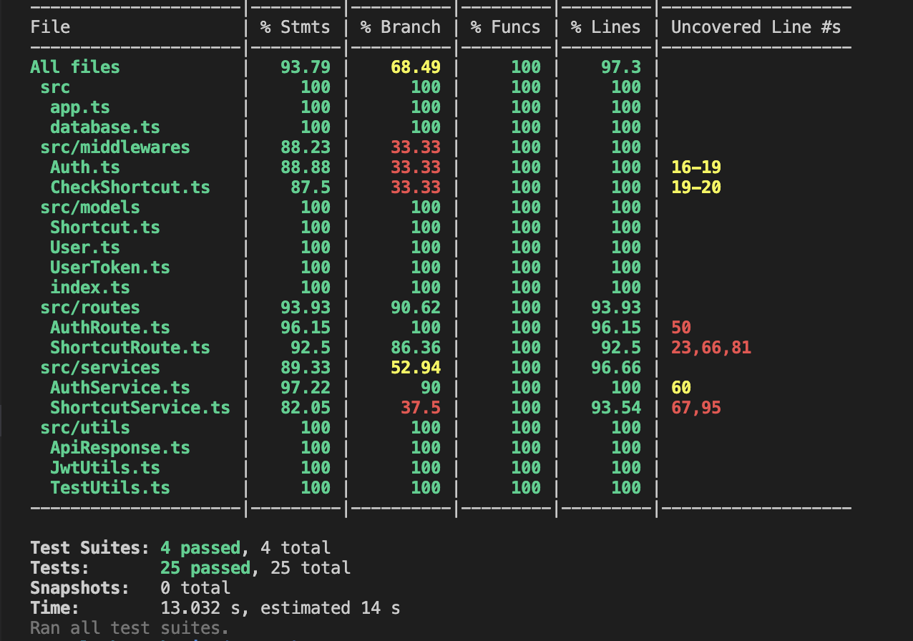

# OSLASH Task

Please follow the link for the problem statement
https://getoslash.notion.site/OSlash-Backend-Engineering-Assignment-OSlash-Clone-6a72b110f7c24b8f928138a9a8ed0ee5

# Techstack

- Backend: Node.js, Express.js
- Database: Mysql
- Testing: Jest
- Libraries: Bcrypt, CORS, JWT, Sequelize

# Flow Diagram



# ER Diagram



# API Design

I have used Rest API with JSON output which can be read by any client.

### Success Response

```json
{
  "status": 200,
  "message": "a success message",
  "data": {}
}
```

### Error Response

```json
{
  "status": 400,
  "message": "an error message",
  "data": {}
}
```

### Unauthenticated Response

```json
{
  "status": 401,
  "message": "Please login.",
  "data": {}
}
```

### Not found Response

```json
{
  "status": 404,
  "message": "data not found.",
  "data": {}
}
```

# Authentication

JWT (JSON web token) is a perfect way to create a new API token with some additional payload and expiry time.
when a user is successfully login then I am generating a token and storing in `user_tokens` table.

> A user can have multiple tokens

# Database

I have chosen MySQL for this project. Mysql is a great database that has relational capabilities.

- we can store millions of records in the table.
- for speeding up queries, we can add indexes.
- we can even join the table if we need.
- if the size of the database is increasing then we can use a database cluster as well.

# Table design

we can definitely scale this structure but after a certain point. MySQL search is not an efficient way to search the record. we can use elastic search or algolia for this which performance is far better than MySQL

# Postman

To test this API, you can use the postman client. I have also added the postman collection to the root folder

# Installation

```sh
# pull code from GitHub
git clone https://github.com/nfraz007/oslash_task.git
cd oslash_task

# run dependencies installation
npm install

# make sure you are running MySQL in your local
# create database oslash_task
# put the credential in the .env file
# start the project
npm run start
```

# Snapshots

Register


Login


Shortcut create


Shortcut list


# Unit Testing and Coverage

I have also added unit tests and test coverage for this project.
to run this please run this command

```sh
npm run test
```


